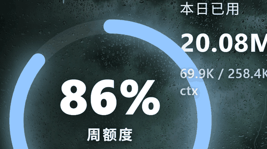
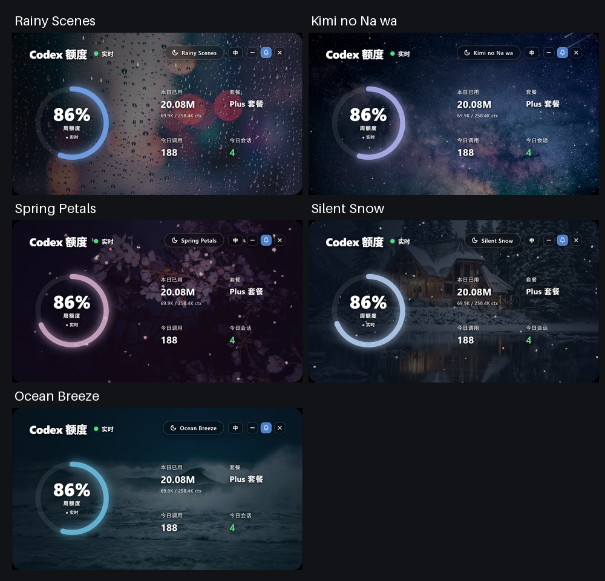
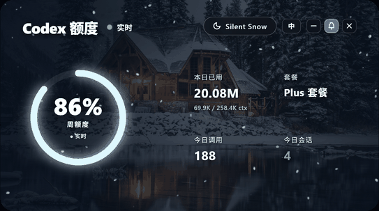
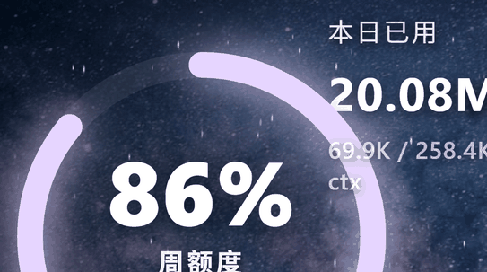

<div align="center">

# Codex Quota Weather

A live Codex quota tray panel with five animated weather scenes for Windows and macOS.

[中文](README.md) · [Install](#one-command-install) · [Usage](#usage) · [Troubleshooting](#troubleshooting)

</div>



## Highlights

- Refreshes the ChatGPT/Codex weekly account quota even while Codex is idle.
- Falls back to the newest Codex session snapshot when the live endpoint is unavailable.
- Shows today's tokens, current context, call count, and session count.
- Includes rain, meteor, blossom, snow, and ocean scenes with three backgrounds each.
- Rotates weather automatically; choose off, 1, 5, 10, or 30 minutes from the tray.
- Follows Codex Desktop (`ChatGPT` / `ChatGPT.exe`) and Codex CLI (`Codex` / `Codex.exe`).
- Supports Windows 10/11, Apple Silicon Macs, and Intel Macs.
- Supports pinning, resizing, a compact floating orb, Chinese/English, and reduced motion.
- Processes data locally and binds its HTTP service only to `127.0.0.1`.

## One-command install

### Windows 10/11

Run in Command Prompt (recommended and shorter; Windows 10/11 includes `curl.exe`):

```cmd
curl -Ls https://github.com/fantarunning/codex-quota-weather/raw/main/install.cmd|cmd
```

This downloads the one-line [install.cmd](install.cmd) entry point, which calls the
full [install.ps1](install.ps1) installer. It does not permanently change the
PowerShell execution policy. Rerun the same CMD command to update; user settings
are preserved.

Or run in PowerShell:

```powershell
powershell -NoProfile -ExecutionPolicy Bypass -Command "irm https://raw.githubusercontent.com/fantarunning/codex-quota-weather/main/install.ps1 | iex"
```

### macOS 13.5+ (Apple Silicon / Intel)

Run in Terminal:

```bash
curl -fsSL https://raw.githubusercontent.com/fantarunning/codex-quota-weather/main/install-macos.sh | bash
```

Neither installer requires administrator access or a preinstalled Node.js. It downloads
a private Node.js 24 runtime for the current architecture, verifies its SHA-256 checksum,
installs Electron, runs the smoke test, enables login startup, and launches the panel.

| Platform | Application | User settings |
| --- | --- | --- |
| Windows | `%LOCALAPPDATA%\Programs\CodexQuotaWeather` | `%APPDATA%\CodexQuotaWeather\config.json` |
| macOS | `~/Library/Application Support/CodexQuotaWeather` | `config.json` in the same directory |

Run the same command again to update without losing window position or preferences.
You can review the [CMD entry point](install.cmd), [Windows installer](install.ps1), or
[macOS installer](install-macos.sh) before executing it.

### Windows CMD install through a proxy

If GitHub, Node.js, or Electron requires a proxy, run these commands in the same
Command Prompt window:

```cmd
set HTTPS_PROXY=http://127.0.0.1:10808
set HTTP_PROXY=http://127.0.0.1:10808
curl -Ls https://github.com/fantarunning/codex-quota-weather/raw/main/install.cmd|cmd
```

Replace `127.0.0.1:10808` with the local proxy address. These temporary variables
expire when that Command Prompt window closes.

## Manual install

Git and Node.js `>= 22.12.0` are required:

```bash
git clone https://github.com/fantarunning/codex-quota-weather.git
cd codex-quota-weather
npm ci
npm test
npm start
```

If Electron needs a proxy, configure it first. Windows PowerShell:

```powershell
$env:HTTPS_PROXY = "http://127.0.0.1:10808"
$env:HTTP_PROXY = "http://127.0.0.1:10808"
npm run setup:electron
```

macOS Terminal:

```bash
export HTTPS_PROXY=http://127.0.0.1:10808
export HTTP_PROXY=http://127.0.0.1:10808
npm run setup:electron
```

## Usage

| Action | Result |
| --- | --- |
| Click the quota ring | Switch to the next weather scene |
| Click the weather name | Change the current scene's background |
| Click `中 / EN` | Switch language |
| Click `−` | Collapse to a weekly-quota orb |
| Click the bell | Toggle always-on-top |
| Click `×` | Hide the panel but keep the tray app running |
| Left-click the tray/menu bar icon | Show or hide the panel |
| Right-click the tray/menu bar icon | Configure Codex following, weather rotation, or quit |
| `Ctrl + wheel` / drag an edge | Resize the panel |

## What the numbers mean

| UI | Meaning | Source |
| --- | --- | --- |
| Ring | Weekly account quota remaining | ChatGPT usage endpoint, with session fallback |
| Used Today | Tokens accumulated in today's Codex sessions | `~/.codex/sessions` |
| Context subline | Latest call tokens / model context window | Latest Codex session |
| Calls Today | Token events recorded today | `~/.codex/sessions` |
| Sessions | Codex sessions active today | `~/.codex/sessions` |

The ring uses a **remaining** percentage. If Codex says “26% used,” this app says
“74% remaining”; both represent the same quota snapshot.

## Scenes








## Configuration

The first run creates `%APPDATA%\CodexQuotaWeather\config.json` on Windows or
`~/Library/Application Support/CodexQuotaWeather/config.json` on macOS.

Important fields include `port`, `refreshMs`, `liveUsageMs`, `lang`, `scale`,
`windowX`, `windowY`, `defaultTheme`, `defaultBackgroundIndex`, `followCodex`,
`watchProcesses`, and `weatherSwitchIntervalMs`. [config.example.json](config.example.json)
contains the public default size and position; positions saved while running remain
in the per-user configuration only.

The current first-run panel defaults are scale `0.696`, position `1213,647`, and
an approximate content size of `473 × 264`. Smaller displays clamp the position
into the visible work area.

## Privacy and security

The app reads the existing token in `~/.codex/auth.json` only to request the ChatGPT
usage endpoint. The token is never returned by the local API, written into this
project, or printed in logs. Codex authentication and session files are read-only.
See [SECURITY.md](SECURITY.md).

## Troubleshooting

### Weekly quota is offline or stale

1. Confirm that Codex is signed in.
2. Run `npm run test:live`.
3. Configure `HTTPS_PROXY` / `HTTP_PROXY` in `~/.codex/.env` or the environment if required.
4. Click the green Live badge to force a refresh.

### The panel does not appear with Codex

Left-click the Windows tray or macOS menu bar icon, verify that “Follow Codex” is enabled, and check the
`watchProcesses` setting.

### Electron download fails

Set `HTTPS_PROXY` and `HTTP_PROXY` in the same terminal window, then rerun the
platform-specific installer. In Command Prompt:

```cmd
set HTTPS_PROXY=http://127.0.0.1:10808
set HTTP_PROXY=http://127.0.0.1:10808
curl -Ls https://github.com/fantarunning/codex-quota-weather/raw/main/install.cmd|cmd
```

### Command Prompt cannot find `curl`

Confirm Windows 10/11 and run `where curl`. If it is still unavailable, use the
PowerShell one-command installer above; no separate curl installation is required.

## Uninstall

Windows Command Prompt:

```cmd
powershell -NoProfile -ExecutionPolicy Bypass -File "%LOCALAPPDATA%\Programs\CodexQuotaWeather\app\uninstall.ps1"
```

Append `-KeepSettings` to preserve preferences:

```cmd
powershell -NoProfile -ExecutionPolicy Bypass -File "%LOCALAPPDATA%\Programs\CodexQuotaWeather\app\uninstall.ps1" -KeepSettings
```

macOS:

```bash
bash "$HOME/Library/Application Support/CodexQuotaWeather/app/uninstall-macos.sh"
```

Add `--keep-settings` to preserve preferences.

## Development

```powershell
npm ci
npm test
npm run test:electron
npm run test:app
npm run test:live
npm run capture:docs
python scripts/build-doc-gifs.py
```

The smoke tests validate JavaScript syntax, the Electron runtime, all 15 bundled
backgrounds, five themes, the local HTTP API, a hidden renderer, and the complete
tray application process.
GitHub Actions repeats them on Windows x64, Apple Silicon macOS, and Intel macOS.

## License

Code is released under the [MIT License](LICENSE). Background photos are not covered
by MIT; see [THIRD_PARTY_NOTICES.md](THIRD_PARTY_NOTICES.md). This is an unofficial,
community-built project and is not an OpenAI product.
